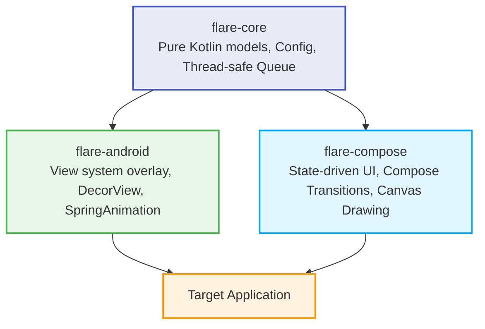

# ⚡️ Flare

[](https://jitpack.io/#RoxyBasicNeedBot/Flare)
[](https://developer.android.com/about/dashboards)
[](https://developer.android.com/about/dashboards)
[](https://kotlinlang.org)
[](https://opensource.org/licenses/BSD-3-Clause)

> **"Expressive alerts for Android — crafted by Roxy."**
> A highly customizable, production-grade alert and custom toast library for Android. Flare provides completely separate, native integration modules for **Jetpack Compose** and the **traditional Android View** system, engineered with zero XML resource overhead and butter-smooth spring physics animations.

---

## 🗺️ Architectural Topology

Flare is designed as a multi-module library keeping the **Core** logic entirely platform-agnostic, paving the way for future Kotlin Multiplatform (KMP) support.



---

## 🌟 Features at a Glance

* 📦 **Zero-XML Footprint** — Built entirely with programmatic vector paths (Views) and Canvas drawing (Compose). Keeps library footprint under **2 KB** binary size to avoid asset bloat.
* ⚡ **Physics-Based Spring Animations** — Powered by `SpringAnimation` (for Views) and state-driven spring specs (for Compose) to deliver buttery-smooth, organic transition curves.
* 🔄 **Intelligent Queue Management** — Backed by a thread-safe `ConcurrentLinkedQueue`. Features two dispatch behaviors:
  * `FlareQueueMode.QUEUE`: Orders alerts sequentially in a FIFO queue.
  * `FlareQueueMode.REPLACE`: Instantly overrides the active alert and purges pending ones.
* 🖐️ **Decelerating Swipe Gestures** — Fling-to-dismiss gesture handling with velocity calculation, spring-driven snapping, or momentum dismissal.
* 🌓 **Dynamic Theme Engine** — Real-time dark/light system state synchronization with fallback overrides for customized styling.
* 📱 **Haptic Precision** — Integrated tactile feedback wrapper invoking modern `VibrationEffect` patterns with clean legacy fallbacks.
* ⏱️ **Countdown Progress Bars** — Horizontal indicator bar draining smoothly relative to the duration.
* 📐 **Edge-to-Edge Integration** — Automatic system inset adjustments matching `WindowInsetsCompat` for status bars, navigation bars, and display cutouts.

---

## 📦 Installation

Add the JitPack repository to your `settings.gradle.kts`:

```kotlin
dependencyResolutionManagement {
    repositoriesMode.set(RepositoriesMode.FAIL_ON_PROJECT_REPOS)
    repositories {
        google()
        mavenCentral()
        maven { url = uri("https://jitpack.io") }
    }
}
```

Then, include the desired Flare modules in your application's `build.gradle.kts`:

```kotlin
dependencies {
    // Core models & queue manager (automatically transitively resolved)
    implementation("com.github.RoxyBasicNeedBot.Flare:flare-core:v1.0.7")

    // For Traditional Android View (XML Layouts) System
    implementation("com.github.RoxyBasicNeedBot.Flare:flare-android:v1.0.7")

    // For Jetpack Compose UI
    implementation("com.github.RoxyBasicNeedBot.Flare:flare-compose:v1.0.7")
}
```

---

## 🚀 Quick Start Guide

### 1. Global Setup (Optional)
Configure global defaults inside your custom `Application` class:

```kotlin
import android.app.Application
import com.roxy.flare.FlareDuration
import com.roxy.flare.FlarePosition
import com.roxy.flare.FlareTheme
import com.roxy.flare.android.Flare

class FlareApplication : Application() {
    override fun onCreate() {
        super.onCreate()
        
        Flare.configure {
            defaultPosition = FlarePosition.BOTTOM
            defaultDuration = FlareDuration.SHORT
            hapticEnabled = true
            theme = FlareTheme.AUTO // Synced with system dark/light configuration
            cornerRadiusDp = 16f
        }
    }
}
```

---

### 2. Traditional Views (Builder Style)
Trigger overlay alerts from any `Activity` with a fluent, descriptive API:

```kotlin
import com.roxy.flare.FlareDuration
import com.roxy.flare.FlarePosition
import com.roxy.flare.FlareType
import com.roxy.flare.android.Flare

// Basic usage
Flare.with(activity)
    .type(FlareType.SUCCESS)
    .message("Transaction completed successfully!")
    .show()

// Advanced customization
Flare.with(activity)
    .type(FlareType.ERROR)
    .message("Network request failed. Please try again.")
    .position(FlarePosition.TOP)
    .duration(FlareDuration.LONG)
    .showProgressBar(true)
    .action("Retry") {
        performRetrySequence()
    }
    .show()
```

---

### 3. Jetpack Compose Integration
Embed `FlareHost` into your Composable layout and invoke alerts within a Coroutine scope:

```kotlin
import androidx.compose.foundation.layout.padding
import androidx.compose.material3.Button
import androidx.compose.material3.Scaffold
import androidx.compose.material3.Text
import androidx.compose.runtime.Composable
import androidx.compose.runtime.rememberCoroutineScope
import androidx.compose.ui.Modifier
import com.roxy.flare.FlareDuration
import com.roxy.flare.FlareType
import com.roxy.flare.compose.FlareHost
import com.roxy.flare.compose.rememberFlareHostState
import kotlinx.coroutines.launch

@Composable
fun HomeScreen() {
    val flareHostState = rememberFlareHostState()
    val scope = rememberCoroutineScope()

    FlareHost(state = flareHostState) {
        Scaffold { paddingValues ->
            Button(
                modifier = Modifier.padding(paddingValues),
                onClick = {
                    scope.launch {
                        flareHostState.show {
                            type = FlareType.WARNING
                            message = "Low battery warning!"
                            duration = FlareDuration.SHORT
                            action("Dismiss") {
                                // Action execution logic
                            }
                        }
                    }
                }
            ) {
                Text("Show Alert")
            }
        }
    }
}
```

---

## 🛠️ Complete Configuration API Matrix

| Property | Type | Default Value | Description |
| :--- | :--- | :--- | :--- |
| `type` | `FlareType` | `FlareType.INFO` | Preset style presets: `SUCCESS`, `ERROR`, `WARNING`, `INFO`, `LOADING`, or `CUSTOM`. |
| `message` | `String` | `""` | The primary text label displayed in the banner. |
| `position` | `FlarePosition` | `FlarePosition.BOTTOM` | Alignment on viewport: `TOP`, `BOTTOM`, or `CENTER`. |
| `duration` | `FlareDuration` | `FlareDuration.SHORT` | Lifecycle limits: `SHORT` (2000ms), `LONG` (3500ms), `INDEFINITE`, or `CUSTOM` (specified in ms). |
| `showProgressBar` | `Boolean` | `false` | Enables a visual, draining line indicating remaining display time. |
| `haptic` | `Boolean` | `true` | Initiates short vibration pulses upon displaying the banner. |
| `icon` | `FlareIconType` | `FlareIconType.Default` | Custom logo overrides. Accepts Bitmaps, Drawables, or `ImageVector` instances. |
| `animationType` | `FlareAnimationType` | `FlareAnimationType.SLIDE` | Entry transition dynamics: `SLIDE`, `FADE`, or `BOUNCE`. |
| `customColor` | `Long?` | `null` | Hex ARGB override color (e.g., `0xFFE040FB`) for background. |
| `queueMode` | `FlareQueueMode` | `FlareQueueMode.QUEUE` | Queue control behavior: `QUEUE` or `REPLACE`. |

---

## 🔬 Deep Technical Architecture

### 1. The Queue Dispatcher (`flare-core`)
At the core of Flare is a decoupled queue dispatcher. Rather than manipulating UI components directly, calling `.show()` constructs a `FlareMessage` model and registers it with the global `FlareQueue` singleton.
The queue runs thread-safely via lock synchronization:
* **FIFO Processing**: The system consumes queue nodes sequentially.
* **Callback Bridging**: Active platform listeners (the `FlareWindowManager` overlay for Views or `FlareHostState` for Compose) subscribe to events, keeping the view layers completely synchronized without direct bindings.

### 2. Window Insets & DecorView Overlay (`flare-android`)
For the traditional View system:
* Flare does not use standard Toast system resources (which are locked by OS restrictions). It overlays dynamically directly onto the host `Activity`'s root `DecorView`.
* To prevent layout overlaps under notched screens or navigation keys, the system hooks into `ViewCompat.setOnApplyWindowInsetsListener`. It retrieves current system bounds and applies compensatory vertical padding depending on whether the banner is positioned at the `TOP` or `BOTTOM`.
* Banners automatically register to the `Application.ActivityLifecycleCallbacks` context, guaranteeing cleanup on host destruction and eliminating memory leaks.

### 3. Gesture dismissal & Spring Mechanics (`flare-compose`)
Inside Jetpack Compose:
* **Physics Bounds**: Gestures are driven by Compose's `Modifier.pointerInput` detecting offset drags.
* Banners apply dynamic damping ratios. Dragging horizontal or vertical offsets translates directly into real-time translation and fade properties.
* A fling with high velocity or an offset exceeding `50%` of screen width automatically triggers a clean exit transition. Otherwise, Compose's built-in spring animators snap the banner back to its default rest state.

---

## 📝 License

This project is licensed under the **BSD 3-Clause License** - see the [LICENSE](LICENSE) file for details.

---

<p align="center">
  <b>Copyright (c) 2026, 𝕽𝕺𝕏𝕐•𝔹𝕒𝕤𝕚𝕔ℕ𝕖𝕖𝕕𝔹𝕠𝕥 ⚡️</b><br>
  <i>All rights reserved. Developed with precision for maximum performance.</i>
</p>
