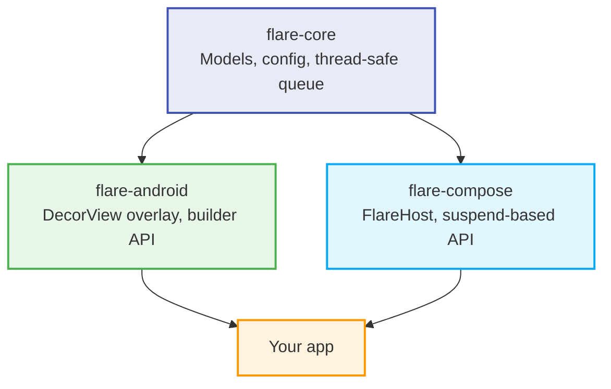

# ⚡ Flare

[](https://jitpack.io/#RoxyBasicNeedBot/Flare)
[](https://github.com/RoxyBasicNeedBot/Flare/actions/workflows/build.yml)
[](https://kotlinlang.org)
[](https://developer.android.com/about/dashboards)
[](https://opensource.org/licenses/BSD-3-Clause)

**Alerts and toasts for Android, done right.**

Android's built-in `Toast` can't be styled, can't queue, can't show an action button, and is increasingly restricted by the OS. Flare replaces it with a fluent, fully customizable alert system — built natively for both the **View system** and **Jetpack Compose**, sharing one platform-agnostic core.

```
Flare.with(activity)
    .type(FlareType.SUCCESS)
    .message("Payment received")
    .show()
```

---

## Contents

- [Features](#features)
- [Architecture](#architecture)
- [Installation](#installation)
- [Quick Start](#quick-start)
- [Configuration Reference](#configuration-reference)
- [How It Works](#how-it-works)
- [Roadmap](#roadmap)
- [Contributing](#contributing)
- [License](#license)

---

## Features

- 🎯 **Two native UIs, one core** — `flare-android` for the traditional View system, `flare-compose` for Jetpack Compose. Pick one or both; everything shares the same `flare-core` queue and config.
- 🔄 **Queue or replace** — `FlareQueueMode.ENQUEUE` plays alerts back-to-back in order; `FlareQueueMode.REPLACE` instantly swaps in a new alert and drops whatever was pending.
- 🖐️ **Real swipe-to-dismiss** — velocity-aware fling gestures with a spring-back snap if the swipe doesn't clear the threshold.
- 🌓 **Theme-aware** — `FlareTheme.AUTO` follows the system's dark/light setting in real time, or pin it with `LIGHT` / `DARK`.
- 📳 **Haptics with correct fallbacks** — modern `VibrationEffect` on API 26+, with a clean legacy path down to the min SDK of 24.
- ⏱️ **Countdown progress bars** — an optional draining bar synced exactly to the alert's display duration.
- 📐 **Edge-to-edge aware** — automatically pads around status bars, nav bars, and display cutouts via `WindowInsetsCompat`, so alerts never sit under system chrome.
- 🧩 **Pure Kotlin core** — `flare-core` has zero Android dependencies, keeping the door open for future Kotlin Multiplatform support.

---

## Architecture

Flare is split into three modules so you only pull in what you need.



`flare-core` owns a single source of truth — a `FlareQueue` singleton that decides what shows next. Both UI modules just listen to it and render whatever it says is current; they never talk to each other directly.

---

## Installation

Add JitPack to `settings.gradle.kts`:

```kotlin
dependencyResolutionManagement {
    repositoriesMode.set(RepositoriesMode.FAIL_ON_PROJECT_REPOS)
    repositories {
        google()
        mavenCentral()
        maven { url = uri("https://jitpack.io") }
    }
}
```

Then add the module(s) you need:

```kotlin
dependencies {
    // flare-core is pulled in transitively — no need to declare it directly

    // Traditional View system
    implementation("com.github.RoxyBasicNeedBot.Flare:flare-android:v1.0.7")

    // Jetpack Compose
    implementation("com.github.RoxyBasicNeedBot.Flare:flare-compose:v1.0.7")
}
```

> Replace `v1.0.7` with whatever tag you've actually published — check the [Releases](https://github.com/RoxyBasicNeedBot/Flare/releases) page for the latest.

---

## Quick Start

### Global defaults (optional)

Set these once, anywhere that runs at app startup — typically your `Application` class:

```kotlin
import com.roxy.flare.android.Flare
import com.roxy.flare.FlarePosition
import com.roxy.flare.FlareDuration
import com.roxy.flare.FlareTheme

Flare.configure {
    defaultPosition = FlarePosition.BOTTOM
    defaultDuration = FlareDuration.SHORT
    theme = FlareTheme.AUTO
    hapticEnabled = true
    cornerRadiusDp = 16f
}
```

### View system

```kotlin
import com.roxy.flare.android.Flare
import com.roxy.flare.FlareType
import com.roxy.flare.FlarePosition
import com.roxy.flare.FlareDuration

// Simple
Flare.with(activity)
    .type(FlareType.SUCCESS)
    .message("Profile updated")
    .show()

// With an action and a progress bar
Flare.with(activity)
    .type(FlareType.ERROR)
    .message("Couldn't reach the server")
    .position(FlarePosition.TOP)
    .duration(FlareDuration.LONG)
    .showProgressBar(true)
    .action("Retry") { retryUpload() }
    .show()
```

### Jetpack Compose

Wrap your screen content in `FlareHost`, then call `show { }` from a coroutine:

```kotlin
import com.roxy.flare.compose.FlareHost
import com.roxy.flare.compose.rememberFlareHostState
import com.roxy.flare.FlareType
import androidx.compose.runtime.rememberCoroutineScope
import kotlinx.coroutines.launch

@Composable
fun HomeScreen() {
    val flareState = rememberFlareHostState()
    val scope = rememberCoroutineScope()

    FlareHost(state = flareState) {
        Button(onClick = {
            scope.launch {
                flareState.show {
                    type = FlareType.WARNING
                    message = "Low battery"
                    action("Dismiss") { /* optional */ }
                }
            }
        }) {
            Text("Show alert")
        }
    }
}
```

`show { }` is a suspend function — it returns a `FlareResult` (`Dismissed` or `ActionPerformed`) once the alert finishes, so you can await the outcome instead of firing and forgetting.

> Place a single `rememberFlareHostState()` near the root of your app (e.g. above your `NavHost`) rather than one per screen, so the same host survives navigation.

---

## Configuration Reference

| Property | Type | Default | Notes |
|---|---|---|---|
| `type` | `FlareType` | `INFO` | `SUCCESS`, `ERROR`, `WARNING`, `INFO`, `LOADING`, or `CUSTOM(colorLong)` |
| `message` | `String` | `""` | Body text, up to 4 lines before truncating |
| `position` | `FlarePosition` | `BOTTOM` | `TOP`, `BOTTOM`, `CENTER` |
| `duration` | `FlareDuration` | `SHORT` | `SHORT` (2000ms), `LONG` (3500ms), `INDEFINITE`, or `CUSTOM(ms)` |
| `showProgressBar` | `Boolean` | `false` | Draining bar tied to `duration` |
| `haptic` | `Boolean` | `true` | Short vibration on show |
| `icon` | `FlareIconType` | `Default` | `Default`, `None`, or `Custom(icon)` — res ID, `Bitmap`, `Drawable`, `Painter`, or `ImageVector` |
| `animationType` | `FlareAnimationType` | `SLIDE` | `SLIDE`, `FADE`, `BOUNCE` |
| `cornerRadiusDp` | `Float?` | `12f` | Card corner radius |
| `customColor` | `Long?` | `null` | ARGB override, e.g. `0xFFE040FB` |
| `queueMode` | `FlareQueueMode` | `ENQUEUE` | `ENQUEUE` plays alerts in order; `REPLACE` cuts the line |

---

## How It Works

**The queue (`flare-core`).** Calling `.show()` builds a `FlareMessage` and hands it to the `FlareQueue` singleton. State transitions (what's currently showing, what's pending) are synchronized internally, and listener callbacks are always dispatched after the lock is released — so a callback is free to immediately trigger another alert without risk of deadlocking.

**The View overlay (`flare-android`).** Flare doesn't use the system `Toast` API (the OS restricts what you can do with it). Instead it attaches directly to the host `Activity`'s `DecorView`, and hooks `Application.ActivityLifecycleCallbacks` to tear everything down automatically when that Activity is destroyed.

**The Compose layer (`flare-compose`).** `FlareHostState` exposes the current message as Compose `State` and resolves a suspend coroutine when it's dismissed. Swipe gestures are tracked with `pointerInput`, with a spring-back animation if the drag doesn't clear roughly half the alert's width.

---

## Roadmap

- [ ] Kotlin Multiplatform target for `flare-core` (iOS/Desktop UI layers)
- [ ] Compose Multiplatform host
- [ ] Snapshot/instrumented UI tests alongside the existing `flare-core` unit tests

---

## Contributing

Issues and PRs are welcome. For anything non-trivial, open an issue first describing what you'd like to change — saves everyone a rewrite later.

```bash
git clone https://github.com/RoxyBasicNeedBot/Flare.git
cd Flare
./gradlew assemble
```

---

## License

BSD 3-Clause — see [LICENSE](LICENSE).

<p align="center"><sub>Built by <a href="https://github.com/RoxyBasicNeedBot">Roxy</a></sub></p>
