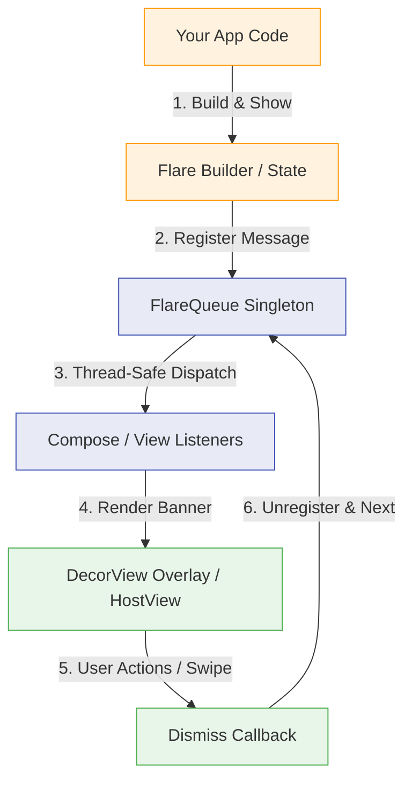

# ⚡ Flare

[](https://jitpack.io/#RoxyBasicNeedBot/Flare)
[](https://github.com/RoxyBasicNeedBot/Flare/actions/workflows/build.yml)
[](https://kotlinlang.org)
[](https://developer.android.com/about/dashboards)
[](https://opensource.org/licenses/BSD-3-Clause)

**Alerts and toasts for Android, done right.**

Android's built-in `Toast` can't be styled, can't queue, can't show action buttons, and has strict OS limitations. **Flare** replaces it with a thread-safe, fluent, fully customizable alert system built natively for both the **View system** and **Jetpack Compose**, sharing one platform-agnostic core.

```kotlin
// Simple View-system call
Flare.with(activity)
    .type(FlareType.SUCCESS)
    .message("Payment received")
    .show()
```

---

## 📖 Contents
- [Features](#features)
- [Architecture & Module Flow](#architecture--module-flow)
- [Installation](#installation)
- [Quick Start](#quick-start)
- [Documentation Web App](#documentation-web-app)
- [Configuration Reference](#configuration-reference)
- [How It Works](#how-it-works)
- [License](#license)

---

## Features

- 🎯 **Dual UI, Single Core** — Native modules for Jetpack Compose (`flare-compose`) and Views (`flare-android`). Both hook into the platform-agnostic `flare-core` state machine.
- 🔄 **Thread-Safe Queueing** — Sequential order execution with `FlareQueueMode.ENQUEUE`, or instant override and purge with `FlareQueueMode.REPLACE`.
- 🖐️ **Swipe-to-Dismiss Gestures** — Velocity-aware fling dismissals with spring-back snapping.
- 🌓 **Dynamic Themes** — Real-time dark/light syncing via `FlareTheme.AUTO` or manual dark/light overrides.
- 📳 **Tactile Vibrations** — Precise haptic feedback using `VibrationEffect` with legacy fallbacks.
- ⏱️ **Countdown Indicators** — Visual progress bar reflecting remaining alert duration.
- 📐 **Cutout & Inset Aware** — Integrates with `WindowInsetsCompat` to pad around status bars, navigation bars, and display notches.

---

## Architecture & Module Flow

Flare separates core state machine logic from the UI representation to keep the modules lightweight and clean.

### Dependency Flow

```
   ┌─────────────────────────────────────────────────────────┐
   │                        Your App                         │
   └────────────┬───────────────────────────────┬────────────┘
                │                               │
   ┌────────────▼────────────┐     ┌────────────▼────────────┐
   │      flare-compose      │     │      flare-android      │
   │ (Jetpack Compose Host)  │     │ (Traditional Views/XML) │
   └────────────┬────────────┘     └────────────┬────────────┘
                │                               │
                └───────────────┬───────────────┘
                                │
                   ┌────────────▼────────────┐
                   │       flare-core        │
                   │ (Models, Config, Queue) │
                   └─────────────────────────┘
```

### Flow of Execution



* `flare-core`: 100% Kotlin module containing queue logic, config presets, and models.
* `flare-android`: Attaches overlays dynamically to the Activity's `DecorView` using spring animations.
* `flare-compose`: Exposes state-driven Compose wrappers utilizing the suspend-based API.

---

## Installation

Add the JitPack repository to your `settings.gradle.kts` file:

```kotlin
dependencyResolutionManagement {
    repositoriesMode.set(RepositoriesMode.FAIL_ON_PROJECT_REPOS)
    repositories {
        google()
        mavenCentral()
        maven { url = uri("https://jitpack.io") }
    }
}
```

Then, add the dependency to your app module's `build.gradle.kts`:

```kotlin
dependencies {
    // Pure Kotlin core models & queue (automatically transitively resolved)
    // Traditional View system support
    implementation("com.github.RoxyBasicNeedBot.Flare:flare-android:v1.0.7")

    // Jetpack Compose UI support
    implementation("com.github.RoxyBasicNeedBot.Flare:flare-compose:v1.0.7")
}
```

---

## Quick Start

### Global Configuration (Optional)

Configure default parameters in your `Application` class:

```kotlin
import com.roxy.flare.android.Flare
import com.roxy.flare.FlarePosition
import com.roxy.flare.FlareDuration
import com.roxy.flare.FlareTheme

Flare.configure {
    defaultPosition = FlarePosition.BOTTOM
    defaultDuration = FlareDuration.SHORT
    theme = FlareTheme.AUTO
    hapticEnabled = true
    cornerRadiusDp = 16f
}
```

### View System

```kotlin
import com.roxy.flare.android.Flare
import com.roxy.flare.FlareType
import com.roxy.flare.FlarePosition
import com.roxy.flare.FlareDuration

// Fluent builder triggers the overlay
Flare.with(activity)
    .type(FlareType.SUCCESS)
    .message("Profile updated")
    .position(FlarePosition.BOTTOM)
    .duration(FlareDuration.SHORT)
    .show()
```

### Jetpack Compose

Wrap your UI in `FlareHost` and call the suspend function `show`:

```kotlin
import com.roxy.flare.compose.FlareHost
import com.roxy.flare.compose.rememberFlareHostState
import com.roxy.flare.FlareType
import androidx.compose.runtime.rememberCoroutineScope
import kotlinx.coroutines.launch

@Composable
fun HomeScreen() {
    val flareState = rememberFlareHostState()
    val scope = rememberCoroutineScope()

    FlareHost(state = flareState) {
        Button(onClick = {
            scope.launch {
                flareState.show {
                    type = FlareType.WARNING
                    message = "Battery Low"
                }
            }
        }) {
            Text("Show Alert")
        }
    }
}
```

---

## Documentation Web App

We provide a premium, modern documentation website matching **Claude.ai aesthetics** containing details, interactive mobile mockups, and step-by-step guides.

### Local Execution (Python Flask)
To run the documentation server locally:
```bash
cd documentation
pip install -r requirements.txt
python app.py
```
Open `http://localhost:5000` in your browser.

### Docker Deployment (Render/Cloud)
To build and run the documentation website inside Docker:
```bash
cd documentation
docker build -t flare-docs .
docker run -p 5000:5000 flare-docs
```

---

## Configuration Reference

| Property | Type | Default | Notes |
|---|---|---|---|
| `type` | `FlareType` | `INFO` | `SUCCESS`, `ERROR`, `WARNING`, `INFO`, `LOADING`, or `CUSTOM` |
| `message` | `String` | `""` | The text content (max 4 lines before truncation) |
| `position` | `FlarePosition` | `BOTTOM` | Viewport placement: `TOP`, `BOTTOM`, `CENTER` |
| `duration` | `FlareDuration` | `SHORT` | `SHORT` (2s), `LONG` (3.5s), `INDEFINITE`, or `CUSTOM(ms)` |
| `showProgressBar` | `Boolean` | `false` | Smooth draining bar synced to remaining duration |
| `haptic` | `Boolean` | `true` | Tactile device vibrations upon displaying |
| `animationType` | `FlareAnimationType`| `SLIDE` | Entry transition physics: `SLIDE`, `FADE`, `BOUNCE` |
| `cornerRadiusDp` | `Float?` | `12f` | Card layout corner rounding |
| `customColor` | `Long?` | `null` | Hex color ARGB code (e.g. `0xFFE040FB`) |
| `queueMode` | `FlareQueueMode` | `ENQUEUE` | Queue processing rules: `ENQUEUE` or `REPLACE` |

---

## How It Works

* **Thread-Safe State Machine**: Banners are managed via a thread-safe synchronized queue wrapper in `flare-core`. Listeners receive show/dismiss notifications only after the queue releases its synchronizing locks, preventing callbacks from triggering lock-order deadlocks.
* **Views Overlay**: Directly queries the Activity's `window.decorView` and inserts the programmatic layouts overlaying existing View hierarchies. Uses standard `VibrationEffect` and `SpringAnimation` objects dynamically.
* **Compose State Wrapper**: Translates queue status changes directly into Compose recompositions while gestures handle translation changes on the screen using pointer input tracking.

---

## License

Licensed under the **BSD 3-Clause License** - see [LICENSE](LICENSE) for details.

<p align="center"><sub>Developed with precision by <a href="https://github.com/RoxyBasicNeedBot">Roxy</a></sub></p>
