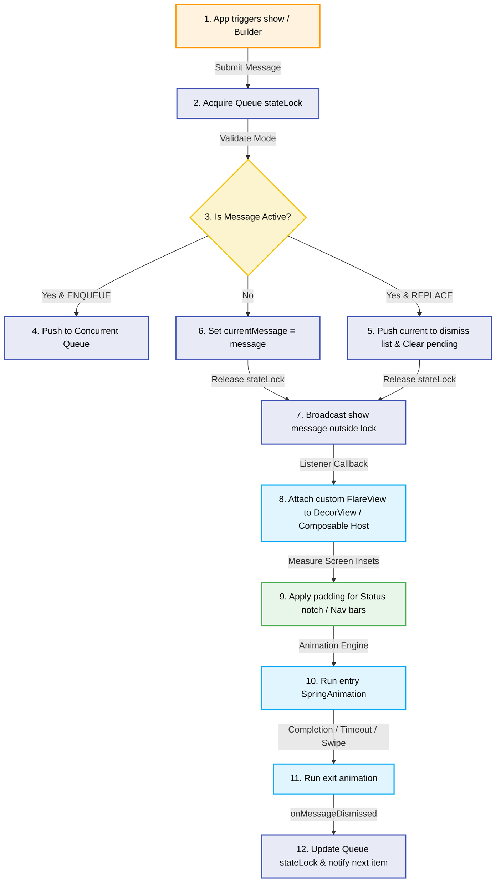

# ⚡ Flare

[](https://jitpack.io/#RoxyBasicNeedBot/Flare)
[](https://github.com/RoxyBasicNeedBot/Flare/actions/workflows/build.yml)
[](https://kotlinlang.org)
[](https://developer.android.com/about/dashboards)
[](https://opensource.org/licenses/BSD-3-Clause)

**Production-grade, highly customizable alerts and toasts for modern Android applications.**

Android's built-in `Toast` API has strict OS-level restrictions, cannot be custom-styled, lacks support for action buttons, and does not provide queue sequencing. **Flare** is a lightweight, zero-XML notification library engineered to provide beautiful, responsive banners across both **Jetpack Compose** and **traditional Android Views**, sharing a single thread-safe Kotlin core.

---

## 📖 Contents
- [Features](#-features)
- [Architecture & Flow of Execution](#-architecture--flow-of-execution)
- [Installation](#-installation)
- [Quick Start Guide](#-quick-start-guide)
  - [1. Global Initialization](#1-global-initialization)
  - [2. Android View System (Builder Pattern)](#2-android-view-system-builder-pattern)
  - [3. Jetpack Compose UI (State-Driven)](#3-jetpack-compose-ui-state-driven)
- [Configuration Reference Matrix](#-configuration-reference-matrix)
- [Technical Specifications & Under-the-Hood Mechanics](#-technical-specifications--under-the-hood-mechanics)
  - [Thread-Safe Queue Engine](#1-thread-safe-queue-engine)
  - [Edge-to-Edge Window Insets Overlay](#2-edge-to-edge-window-insets-overlay)
  - [Compose Pointer Gesture Mechanics](#3-compose-pointer-gesture-mechanics)
- [License & Authorship](#-license--authorship)

---

## 🌟 Features

* 🎯 **Unified Platform Core** — Core configurations, state machine, and scheduling models reside in a pure-Kotlin module (`flare-core`), ready for Kotlin Multiplatform (KMP) targets.
* 🔄 **Synchronized Thread-Safe Queueing** — Safely sequence alerts using `FlareQueueMode.ENQUEUE` (FIFO execution) or instantly replace active alerts using `FlareQueueMode.REPLACE`.
* 🖐️ **Physics-Based Swipe Gestures** — Real-time touch velocity tracking. Fling to dismiss or trigger spring-back snap transitions automatically if the threshold is not cleared.
* 🌓 **Dynamic Theme Alignment** — Follows dark/light system presets automatically (`FlareTheme.AUTO`) or pins explicit `LIGHT`/`DARK` UI configurations.
* 📳 **Haptic Feedback Wrappers** — Modern tactile vibration feedback using `VibrationEffect` with defensive fallbacks for older devices.
* ⏱️ **Countdown Indicator Bar** — Horizontal progress bar draining dynamically and smoothly relative to the remaining display duration.
* 📐 **Notch & Cutout Protection** — Adjusts vertical offsets dynamically using `WindowInsetsCompat` for status bars, navigation overlays, and physical notches.
* 📦 **Zero-XML Footprint** — Entirely written using programmatic Canvas drawing and vector paths, maintaining a compiled library size of **under 2 KB** to avoid binary bloat.

---

## 🏛️ Architecture & Flow of Execution

Flare separates scheduling mechanics from presentation. Banners do not manipulate the UI layer directly; instead, they flow through a synchronized scheduling pipeline.

### Component Map

```
               ┌────────────────────────────────────────────────────────┐
               │                     Your App Code                      │
               └───────────┬────────────────────────────────┬───────────┘
                           │                                │
                           │ (Compose UI)                   │ (View System UI)
                           ▼                                ▼
               ┌───────────────────────┐        ┌───────────────────────┐
               │     flare-compose     │        │     flare-android     │
               │ (FlareHost, state)    │        │ (DecorView overlay)   │
               └───────────┬───────────┘        └───────────┬───────────┘
                           │                                │
                           │     Registers UI Listeners     │
                           └───────────────┬────────────────┘
                                           │
                                           ▼
               ┌────────────────────────────────────────────────────────┐
               │                       flare-core                       │
               │  (Thread-Safe Queue, Configs, Message Models)          │
               └────────────────────────────────────────────────────────┘
```

### Color-Coded Execution Pipeline

Below is the execution flow from trigger to dismissal. Colors represent the transition boundaries between the App context, Core Queue, and the Android OS Window layers:



> [!NOTE]
> **Why Notify Outside the Lock?**
> Standard synchronized locks are re-entrant on the same thread, meaning double locks don't block. However, keeping the listener notification *outside* the synchronized block prevents blocking thread resources when running custom user logic (e.g. running action button callbacks) and avoids potential cross-lock deadlocks.

---

## 📦 Installation

Add the JitPack maven path to your root `settings.gradle.kts` configuration:

```kotlin
dependencyResolutionManagement {
    repositoriesMode.set(RepositoriesMode.FAIL_ON_PROJECT_REPOS)
    repositories {
        google()
        mavenCentral()
        maven { url = uri("https://jitpack.io") }
    }
}
```

Include the native module libraries inside your app module's `build.gradle.kts`:

```kotlin
dependencies {
    // flare-core is pulled in transitively — no need to declare it directly

    // Traditional XML / View System Integration
    implementation("com.github.RoxyBasicNeedBot.Flare:flare-android:v1.0.7")

    // Jetpack Compose Integration
    implementation("com.github.RoxyBasicNeedBot.Flare:flare-compose:v1.0.7")
}
```

---

## 🚀 Quick Start Guide

### 1. Global Initialization

Configure your default configurations inside your `Application` class or main launcher entrypoint:

```kotlin
import android.app.Application
import com.roxy.flare.android.Flare
import com.roxy.flare.FlarePosition
import com.roxy.flare.FlareDuration
import com.roxy.flare.FlareTheme

class MainApplication : Application() {
    override fun onCreate() {
        super.onCreate()
        
        // Globally initialize default configurations
        Flare.configure {
            defaultPosition = FlarePosition.BOTTOM
            defaultDuration = FlareDuration.SHORT
            theme = FlareTheme.AUTO // Real-time dark/light mode switching
            hapticEnabled = true
            cornerRadiusDp = 16f
        }
    }
}
```

---

### 2. Android View System (Builder Pattern)

Launch customized overlay banners programmatically using the fluent builder API:

```kotlin
import com.roxy.flare.android.Flare
import com.roxy.flare.FlareType
import com.roxy.flare.FlarePosition
import com.roxy.flare.FlareDuration

// Standard Warning Alert
Flare.with(activity)
    .type(FlareType.WARNING)
    .message("Unable to sync database logs.")
    .show()

// Advanced Custom Builder
Flare.with(activity)
    .type(FlareType.ERROR)
    .message("Transaction failed. Please try again.")
    .position(FlarePosition.TOP) // Drops from the top, notches accounted
    .duration(FlareDuration.LONG)
    .showProgressBar(true) // Visual draining bar
    .action("Retry") {
        executePaymentRetry()
    }
    .show()
```

---

### 3. Jetpack Compose UI (State-Driven)

Wrap your screen contents inside `FlareHost` and show alerts using the suspend-based API:

```kotlin
import androidx.compose.foundation.layout.padding
import androidx.compose.material3.Button
import androidx.compose.material3.Scaffold
import androidx.compose.material3.Text
import androidx.compose.runtime.Composable
import androidx.compose.runtime.rememberCoroutineScope
import androidx.compose.ui.Modifier
import com.roxy.flare.FlareType
import com.roxy.flare.compose.FlareHost
import com.roxy.flare.compose.rememberFlareHostState
import kotlinx.coroutines.launch

@Composable
fun MainComposeScreen() {
    val flareState = rememberFlareHostState()
    val scope = rememberCoroutineScope()

    // Host handles gesture swipes, spring animations, and queue listening
    FlareHost(state = flareState) {
        Scaffold { paddingValues ->
            Button(
                modifier = Modifier.padding(paddingValues),
                onClick = {
                    scope.launch {
                        // Suspend function awaits result (Dismissed / ActionPerformed)
                        val result = flareState.show {
                            type = FlareType.SUCCESS
                            message = "Data exported successfully!"
                            action("Undo") {
                                performUndo()
                            }
                        }
                    }
                }
            ) {
                Text("Export File")
            }
        }
    }
}
```

> [!TIP]
> **Single Host State Rule**:
> Place a single `rememberFlareHostState()` at the root of your Composable tree (e.g., above your `NavHost`) instead of declaring one per screen. This ensures a single queue handles transitions gracefully during screen navigation.

---

## 🛠️ Configuration Reference Matrix

Configure your parameters in both XML/View and Compose builders:

| Property | Type | Default | Description / Notes |
| :--- | :--- | :--- | :--- |
| `type` | `FlareType` | `INFO` | Alert styles: `SUCCESS` (✓), `ERROR` (✗), `WARNING` (⚠), `INFO` (ℹ), `LOADING` (spinner), or `CUSTOM` |
| `message` | `String` | `""` | Title / body text. Auto-truncated with ellipsis after 4 lines. |
| `position` | `FlarePosition` | `BOTTOM` | Viewport alignment: `TOP` (status bar padded), `BOTTOM` (navbar padded), `CENTER`. |
| `duration` | `FlareDuration` | `SHORT` | Lifecycle: `SHORT` (2000ms), `LONG` (3500ms), `INDEFINITE`, or `CUSTOM(ms)`. |
| `showProgressBar` | `Boolean` | `false` | Visual draining indicator synced to remaining display duration. |
| `haptic` | `Boolean` | `true` | Device tactile vibration trigger upon display of banner. |
| `icon` | `FlareIconType` | `Default` | Icon presets: `Default`, `None`, or override with `Custom(icon)` (Bitmaps/Painters). |
| `animationType` | `FlareAnimationType` | `SLIDE` | Entry transition physics: `SLIDE` (spring displacement), `FADE`, `BOUNCE`. |
| `cornerRadiusDp` | `Float?` | `12f` | Card layout corner rounding. |
| `customColor` | `Long?` | `null` | Hex ARGB override color (e.g. `0xFF6A1B9A`) for the background card. |
| `queueMode` | `FlareQueueMode` | `ENQUEUE` | Queue dispatch mode: `ENQUEUE` (FIFO order) or `REPLACE` (override queue). |

---

## 🔬 Technical Specifications & Under-the-Hood Mechanics

### 1. Thread-Safe Queue Engine

The queuing system in `flare-core` coordinates scheduling using an thread-safe singleton state machine:

```kotlin
object FlareQueue {
    private val stateLock = Any()
    private val queue = ConcurrentLinkedQueue<FlareMessage>()
    private val listeners = mutableListOf<FlareQueueListener>()
    
    @Volatile
    private var currentMessage: FlareMessage? = null
}
```

* **Lock Contention Management**: State changes (like `enqueue`, `onMessageDismissed`, and `clear`) are guarded by `stateLock`.
* **Lock-Free Notifications**: To prevent listener actions from holding the lock or causing deadlocks in re-entrant callbacks, notifications (`notifyShow` and `notifyDismiss`) are executed only after releasing the synchronized block.
* **Leak-Proof Queue Drainage**: When `clear()` or `enqueue(REPLACE)` is invoked, all pending queued items are gathered and explicitly dismissed via `notifyDismiss`. This triggers their registered listeners to clean up and unregister, eliminating memory leaks of dropped messages.

### 2. Edge-to-Edge Window Insets Overlay

Traditional Android toasts are heavily restricted. `flare-android` bypasses this by overlaying views directly onto the Host Activity's `decorView`:

```kotlin
val decorView = activity.window?.decorView as? ViewGroup
decorView.addView(flareView)
```

* **Insets Adaptation**: The overlay applies padding dynamically using `ViewCompat.setOnApplyWindowInsetsListener` to wrap around notches, cutouts, status bars, and navigation buttons.
* **Main Thread Confinement**: View updates (attaching, dismissing, or post-delay timeouts) check the calling thread and hop to the Main UI Thread using `Handler(Looper.getMainLooper())` to prevent crashes when triggered from background contexts.
* **Lifecycle Cleanup**: The library hooks into `Application.ActivityLifecycleCallbacks` to automatically clear overlays and active progress animators when the activity is destroyed.

### 3. Compose Pointer Gesture Mechanics

In Jetpack Compose, gestures are handled inside the alert Composable:
* **Physics Spring Tracking**: Touch gestures are tracked via `Modifier.pointerInput` detecting drag offsets.
* **Damping & Snap**: The drag displacement determines alert layout offset and alpha. If a drag exceeds `50%` of screen width or has high velocity, it dismisses the alert. Otherwise, a spring animation snaps the card back to its home boundaries.
* **DisposableEffect Integration**: When the `FlareHostState` leaves the composition tree, `DisposableEffect` invokes `state.release()`, resolving all active suspend continuations and unregistering the listener.

---

## 📝 License & Authorship

This library is licensed under the **BSD 3-Clause License** - see the [LICENSE](LICENSE) file for details.

---

<p align="center">
  <b>Developed with precision and care by <a href="https://github.com/RoxyBasicNeedBot">Roxy</a> ⚡️</b><br/>
  <i>Copyright &copy; 2026, 𝕽𝕺𝕏𝕐•𝔹𝕒𝕤𝕚𝕔ℕ𝕖𝕖𝕕𝔹𝕠𝕥. All rights reserved.</i>
</p>
